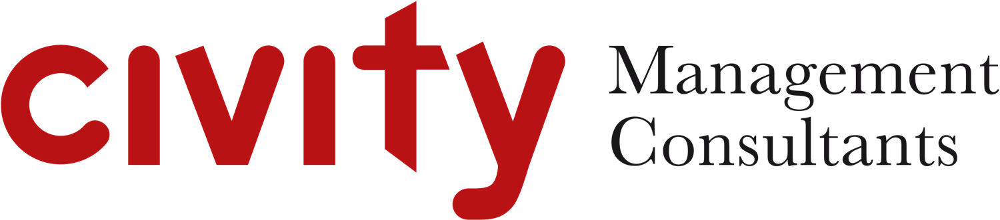

# Die Flachwurzelsituation (ITS Hackathon)

This repository contains the prototype we build at the DB ITS-Hackathon in Hamburg on 20. and 21. October 2017.

Please find a [live version here](http://its-hackathon-2017.civity.de).

*Please note: The documentation is work in progress and will be supplemented.*

## Motivation
In October 2017, the storm Xavier paralyzed the operation of Deutsche Bahn in Northern Germany. Trains could not operate as trees have fallen on the tracks or destroyed overhead wires.

Therefore, we analyzed which tracks are exposed to the risk of falling trees. We combined several datasets and illustrate where trees are close to tracks in Hamburg and how likely they are exposed to a storm.

## Features
- A website summarizes all our findings and provides background information
- An interactive map focusses on Hamburg and points out which trees are likely to disrupt the operation of trains
- Finally, a simulation allows examining scenarios for different wind direction and tree heights

## Datasets used:
All Datasets are publicly available. In particular, we used:
- [Track System by Deutsche Bahn](http://data.deutschebahn.com/dataset/geo-strecke)
- [Dataset of trees in public areas in Hamburg](http://suche.transparenz.hamburg.de/dataset/strassenbaumkataster-hamburg6)
- [Dataset of trees at the port of Hamburg](http://suche.transparenz.hamburg.de/dataset/strassenbaumkataster-hamburger-hafen2)
- [Dataset on the condition of soil in Hamburg ](http://suche.transparenz.hamburg.de/dataset/geologische-karte-1-50-0005)

## Team
We are a team of analysts and developers regularly working together. This project, however, has been build in our spare time.
- Volker
- Moritz
- Björn
- Achim
